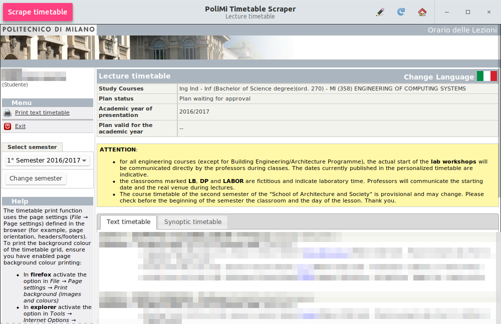

# PoliMi Timetable Scraper
Scrapes the timetable from PoliMi online services and converts it to well-known iCal format



## Usage

```shell
$ python2 src/scraper.py
```

Use the built-in web browser to navigate to the timetable. Cookies are stored in `~/.config/poliscraper/cookies.sqlite` The home button will bring you to [your custom lesson schedule](https://servizionline.polimi.it/portaleservizi/portaleservizi/controller/servizi/Servizi.do?evn_srv=evento&idServizio=398) based on your study plan.

The timetable generated from a [degree program](https://www4.ceda.polimi.it/manifesti/manifesti/controller/ManifestoPublic.do?lang=EN) can be used as well.

As soon as the timetable is loaded, the *Scrape timetable* button on the top bar will become clickable. Click it, pick a path and a file name, save your iCal and import it into your favourite calendar application ;)

### Importing into Google Calendar

1. Go to [calendar.google.com](https://calendar.google.com).
1. Click on the cog on the top right, select *Settings*, then go to *Calendars*.
1. *(Optional)* Create a new calendar. This is suggested as the generated calendar may contain errors; importing it to a separate calendar allows you to simply delete it if you need to.
1. Go back to *Settings > Calendar*, then press *Import calendar*.
1. Upload the generated iCal file. Make sure you import it to the right calendar by picking it from the *Calendar* dropdown menu.

## Troubleshooting

#### The "Scrape timetable" button is not clickable

Make sure you're viewing the *textual* timetable page. The synoptic timetable doesn't have enough information to be scraped

#### I'm getting an error message

Before complaining on the issue tracker, **make sure you're running the latest revision** from GitHub.

If you're running the latest revision and the issue is still there, enable debug flags, copy the command line output post it in new issue on GitHub.

```shell
$ python2 src/scraper.py --debug-divs --debug-regex --debug-timetable
```

Make sure you **remove any personal information**, and that you use an **[external pastebin service](http://hastebin.com)** for the program output. Keep your shitposting on Facebook, not on GitHub. Thank you <3